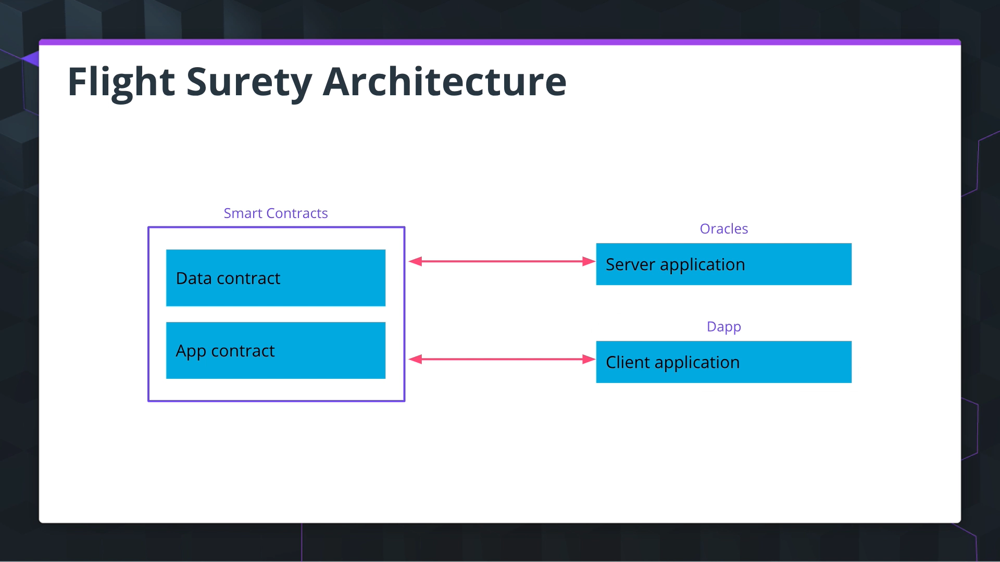

# FlightSurety

FlightSurety is a Dapp that helps manage flight delay insurance for passengers.

# Major Goals

- Overall, manage delay insurance for passengers
- Managed as a collaboration between multiple airlines. This dapp should make be able to co-ordinate the flights and provide data for multiple airlines ?!
- Give ability for passengers to purchase the FlightSurety Insurance prior to a Flight
- If the flight is delayed due to airline fault (provided by Oracle), passengers are paid 1.5X(arbitrary number) the amount they paid for the insurance.
- Oracle provides all the flight statuses of the airlines (Could be an open API too)

## Technical Paradigms For This Project

- Separation of Concerns
- SHA-3 Hashing
- Event Driven Data Share

## High Level Systems Architecture

## Install

This repository contains Smart Contract code in Solidity (using Truffle), tests (also using Truffle), dApp scaffolding (using HTML, CSS and JS) and server app scaffolding.

To install, download or clone the repo, then:

`npm install`
`truffle compile`

## Develop Client

To run truffle tests:

App: `npm run test:contracts:app`
App and watch for changes from test specs and contracts: `npm run test:contracts:app:watch`
Data(oracle): `npm run test:contracts:data`

To use the dapp:

`truffle migrate`
`npm run dapp`

To view dapp:

`http://localhost:8000`

## Develop Server

`npm run server`
`truffle test ./test/oracles.js`

# Run Full Dapp And Watch Your Contract and Src/Javascript Changes

### Windows

`npm run dapp:dev:sample1:windows`

### Unix

`npm run dapp:dev:sample1:unix`

## Deploy

To build dapp for prod:
`npm run dapp:prod`

Deploy the contents of the ./dapp folder

## Resources

- [How does Ethereum work anyway?](https://medium.com/@preethikasireddy/how-does-ethereum-work-anyway-22d1df506369)
- [BIP39 Mnemonic Generator](https://iancoleman.io/bip39/)
- [Truffle Framework](http://truffleframework.com/)
- [Ganache Local Blockchain](http://truffleframework.com/ganache/)
- [Remix Solidity IDE](https://remix.ethereum.org/)
- [Solidity Language Reference](http://solidity.readthedocs.io/en/v0.4.24/)
- [Ethereum Blockchain Explorer](https://etherscan.io/)
- [Web3Js Reference](https://github.com/ethereum/wiki/wiki/JavaScript-API)
